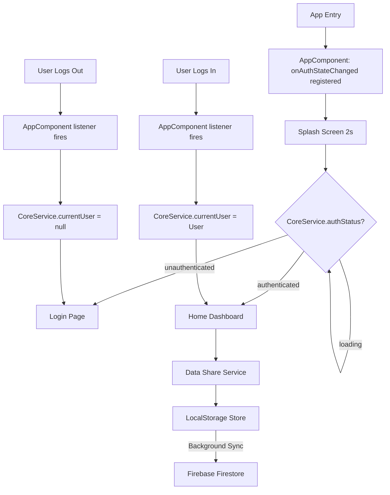

# Architecture Blueprint: Novus Flexy Template

| Version | Status | Date | Owner |
| :--- | :--- | :--- | :--- |
| 1.0 | 🏗️ Draft | 2026-03-14 | Watson (Architect) |
| 1.1 | ✅ Updated | 2026-03-16 | Watson (Architect) |

## 1. Core Platform Evaluation: Angular 21
**Strategic Decision:** We will proceed with **Angular 21** migration.
*   **Rational:** Since this is a template app for the next several years, starting with the latest major version (v21) minimizes technical debt for all future projects.
*   **Key v21 Enhancements:** Optimized Signal-based change detection, improved zoneless stability, and streamlined standalone component hydration.

## 2. Infrastructure Architecture
### 2.1 Monorepo Strategy
*   **Workspace:** Angular Workspace (standard multi-project).
*   **Applications:**
    *   `admin`: Enterprise UI (Port 4200).
    *   `user-app`: Consumer UI (Port 4400).
*   **Shared Layer:** We will implement a `shared/` directory (leveraging `tsconfig.json` paths) to house:
    *   `CoreService`: Signal-based Auth & Initialization.
    *   `DataShareService`: Store-and-Forward logic.
    *   `UI Components`: Tailwind/Material hybrid base components.

### 2.2 Backend Interface (Firebase v11+)
*   **Auth:** Firebase Authentication with Username/Email protocol.
*   **Database:** Firestore with offline caching enabled.
*   **AI Integration (Future-Proofing):** Standardize on **Google AI (Gemini)** via the `@google/genai` package.
    *   **Architecture Strategy:** AI logic will be abstracted into a `GenerativeAiService` to handle prompt orchestration, multimodal inputs, and response parsing.
    *   **Deployment:** Prefer Firebase Cloud Functions for sensitive AI operations to protect API keys.
*   **Persistence Strategy:** Two-stage Store-and-Forward.
    1.  **State Logic:** Angular `signal` updates immediately.
    2.  **Local Persistence:** `LocalStorage` sync via `effect()`.
    3.  **Cloud Sync:** Background process reconciles `LocalStorage` with Firestore using **Short-UUID** (e.g., `nanoid` or `short-uuid` package) for identifiers. This ensures readable console logs and manageable database document keys while maintaining collision resistance for offline-first creation.

## 3. UI & Styling Framework
### 3.1 Hybrid System
*   **Material 21:** Provides the behavior (MDC-based internals).
*   **Tailwind 4+:** Provides the layout and precise styling.
*   **Integration:** A centralized `styles.scss` will import Material theme variables and export them as CSS Custom Properties for Tailwind's `config` to consume.

## 4. Auth State Architecture

### 4.1 Single Listener, Shared Signal

Firebase Auth state is observed **exactly once** — in `AppComponent` via `onAuthStateChanged()`. This listener is registered at app bootstrap and lives for the entire session. Its result is written into a `WritableSignal` owned by `CoreService`.

All other actors (guards, components, services) **read** the signal — they never
subscribe to Firebase directly.

```
Firebase SDK
    │
    ▼
onAuthStateChanged()  [AppComponent — registered once]
    │
    ├──► CoreService.setCurrentUser(user)   → WritableSignal<User|null|undefined>
    │         │
    │         ├── computed: authStatus = 'loading' | 'authenticated' | 'unauthenticated'
    │         │
    │         ├── AuthGuard:          reads signal to gate /dashboard routes
    │         ├── HeaderComponent:    reads signal for login/avatar toggle
    │         └── SettingsComponent:  reads signal to detect admin role
    │
    └──► Router.navigate()  [AppComponent — top-level routing logic]
          ├── First emission (app boot) — deferred to SplashComponent
          ├── Login transition  → /dashboard/home
          └── Logout transition → /authentication/login
```

### 4.2 Responsibility Matrix

| Layer | Responsibility | Owns Auth Subscription? |
| :--- | :--- | :--- |
| `AppComponent` | Register listener; drive routing on auth transitions | **Yes — one subscription** |
| `CoreService` | Store auth state as `WritableSignal`; expose `computed` status | No |
| `SplashComponent` | 2-second brand display; reads `authStatus` for initial navigation | No |
| `AuthGuard` | Blocks `/dashboard` access until auth resolves; redirects to login | No |
| All other components | Read `CoreService.currentUser` / `authStatus` | No |

### 4.3 Initialization Sequence (The Splash Flow)
1.  **App Bootstrap** — Angular initializes; `AppComponent` registers `onAuthStateChanged`.
2.  **Splash Display** — `SplashComponent` renders; 2-second minimum timer starts.
3.  **Auth Resolution** — Firebase emits first user value (100–300 ms); `AppComponent` writes to `CoreService.currentUser` signal. `isFirstEmission` flag is cleared.
4.  **Navigation Decision** — Once both timer has elapsed and `authStatus !== 'loading'`, `SplashComponent` navigates:
    - Authenticated → `/dashboard/home`
    - Unauthenticated → `/authentication/login`
5.  **Session Transitions** — Any subsequent auth change (login / logout / token expiry) is caught by `AppComponent`'s persistent listener and triggers an immediate redirect.

### 4.4 Session Transition Logic (AppComponent)

```typescript
onAuthStateChanged(auth, (user) => {
  core.setCurrentUser(user);       // 1. update shared signal

  if (isFirstEmission) {           // 2. skip — SplashComponent drives initial route
    isFirstEmission = false;
    return;
  }

  const url = router.url;
  if (user) {                      // 3a. login event
    if (url.startsWith('/authentication') || url === '/splash') {
      router.navigate(['/dashboard/home']);
    }
  } else {                         // 3b. logout / session expiry
    if (url.startsWith('/dashboard')) {
      router.navigate(['/authentication/login']);
    }
  }
});
```

## 5. Quality Assurance Architecture
### 5.1 Test Organization (Playwright)
*   **Configuration:** Unified `playwright.config.ts` with cross-project definitions.
*   **Naming Convention:** Test files mapped to User Story IDs (e.g., `AUT-201.spec.ts`).
*   **Page Object Model (POM):** Shared selectors for common atoms (Login button, Header icon) to minimize maintenance.

---

## 6. Diagram: System Logic Flow


---

## 7. Data Layer Architecture

### 7.1 Design Decisions

| Decision | Choice | Rationale |
| :--- | :--- | :--- |
| Type contract | **`interface`** (not `class` or `type`) | Zero runtime cost; extendable with `extends`; declaration-mergeable; conventional for Angular/TypeScript data contracts |
| UI type vs Firestore type | **Split** — `SiteSettings` (UI) vs `SiteSettingsDoc` (Firestore) | Components never see `_schemaVersion`; service handles versioning transparently |
| Versioning field | **`_schemaVersion: number`** | Underscore prefix signals "infrastructure, not user data"; inspectable in the Firebase console; drives migration branches |
| Model file location | **`src/app/models/*.model.ts`** per app | Co-located with the app that owns the data; future path to `shared/` when a third app is added |
| Serialize/Deserialize | **Collocated in model file** | One file = interface + both functions; AI-agent-friendly; easy to find during migration work |
| Null sanitisation | **`serializeXxx()` — omit optional fields when absent** | Firestore rejects `null` values; omitting is idiomatic; `deserializeXxx()` restores safe defaults on read |

### 7.2 Model File Catalogue

| File | Firestore path | UI type exported | Firestore type |
| :--- | :--- | :--- | :--- |
| `user-app/src/app/models/user-profile.model.ts` | `users/{uid}` | *(same as doc)* | `UserProfileDoc` |
| `admin/src/app/models/site-settings.model.ts` | `settings/global` | `SiteSettings` | `SiteSettingsDoc` |

### 7.3 Document Contract Pattern

Every Firestore collection follows a three-export pattern in its model file:

```typescript
// 1. Schema version constant — bump this when fields change
export const MY_DOC_SCHEMA_VERSION = 1;

// 2. Firestore document interface — includes _schemaVersion
export interface MyDoc {
  _schemaVersion: number;   // always first; never stripped
  requiredField: string;
  optionalField?: string;   // never null — omit when absent
}

// 3a. Normalize incoming Firestore data → typed object with safe defaults
export function deserializeMyDoc(raw: unknown): MyDoc {
  const data = (raw ?? {}) as Partial<MyDoc>;
  const version = data._schemaVersion ?? 0;

  // Migration gate — add branches here as SCHEMA_VERSION bumps
  if (version < MY_DOC_SCHEMA_VERSION) { /* v0→v1 migrations */ }

  return {
    _schemaVersion: MY_DOC_SCHEMA_VERSION,
    requiredField: data.requiredField ?? 'default',
    ...(data.optionalField ? { optionalField: data.optionalField } : {}),
  };
}

// 3b. Produce a null-free Firestore payload from the typed object
export function serializeMyDoc(doc: MyDoc): Record<string, unknown> {
  const out: Record<string, unknown> = {
    _schemaVersion: doc._schemaVersion,  // always written
    requiredField: doc.requiredField,
  };
  if (doc.optionalField) out['optionalField'] = doc.optionalField;
  return out;
}
```

### 7.4 StoreForwardService — Transform Integration

`StoreForwardService.set()` and `.sync()` accept an optional `StoreForwardTransforms<T>` argument:

```typescript
export interface StoreForwardTransforms<T> {
  serialize?:   (data: T)       => Record<string, unknown>;
  deserialize?: (raw: unknown)  => T;
}
```

- **`serialize`** is called before every **Firestore write** — strips nulls, adds `_schemaVersion`.  
- **`deserialize`** is called on every **Firestore read** (realtime snapshot) — normalises schema, fills defaults.  
- `localStorage` always stores the **full typed value** (including `_schemaVersion`) so cache reads are typed correctly.  
- If no transforms are provided the service behaves identically to before — backward compatible.

```typescript
// Call site (ProfileComponent)
this.storeForward.set(PROFILE_KEY, profileDoc, `users/${uid}`, {
  serialize:   serializeUserProfile,
  deserialize: deserializeUserProfile,
});

this.storeForward.sync<UserProfileDoc>(PROFILE_KEY, `users/${uid}`, {
  deserialize: deserializeUserProfile,
});
```

### 7.5 Schema Migration Strategy

When a field is added, renamed, or removed:

1. **Bump** `MY_DOC_SCHEMA_VERSION` by 1.
2. **Add a migration branch** in `deserializeXxx()`:
   ```typescript
   if (version < 2) {
     // e.g. rename 'name' → 'displayName' for v1→v2
     (data as any).displayName ??= (data as any).name;
   }
   ```
3. **Update `serializeXxx()`** to write the new field shape.
4. Existing documents are migrated lazily on the **next read** — no batch migrations needed for template-scale data.

For production apps with large Firestore collections, a Cloud Function migration script should be used alongside the lazy strategy.

---
*Authored by Watson (System Architect)*
