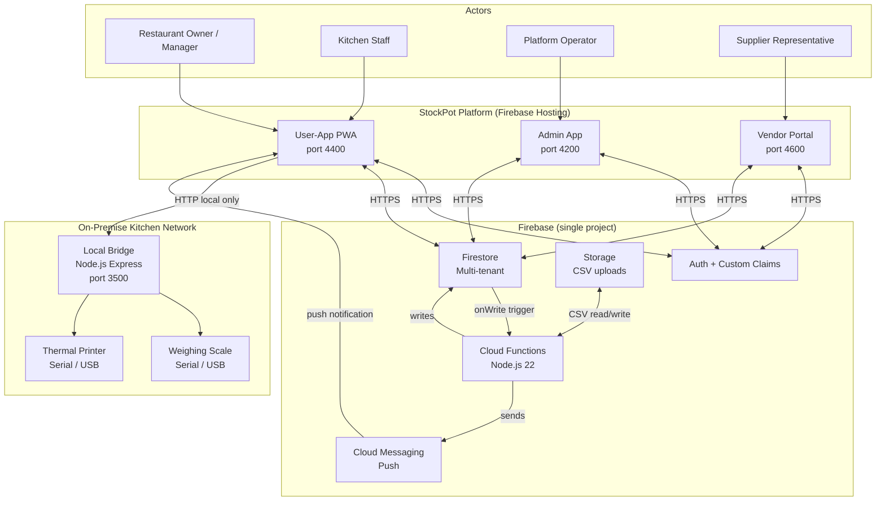
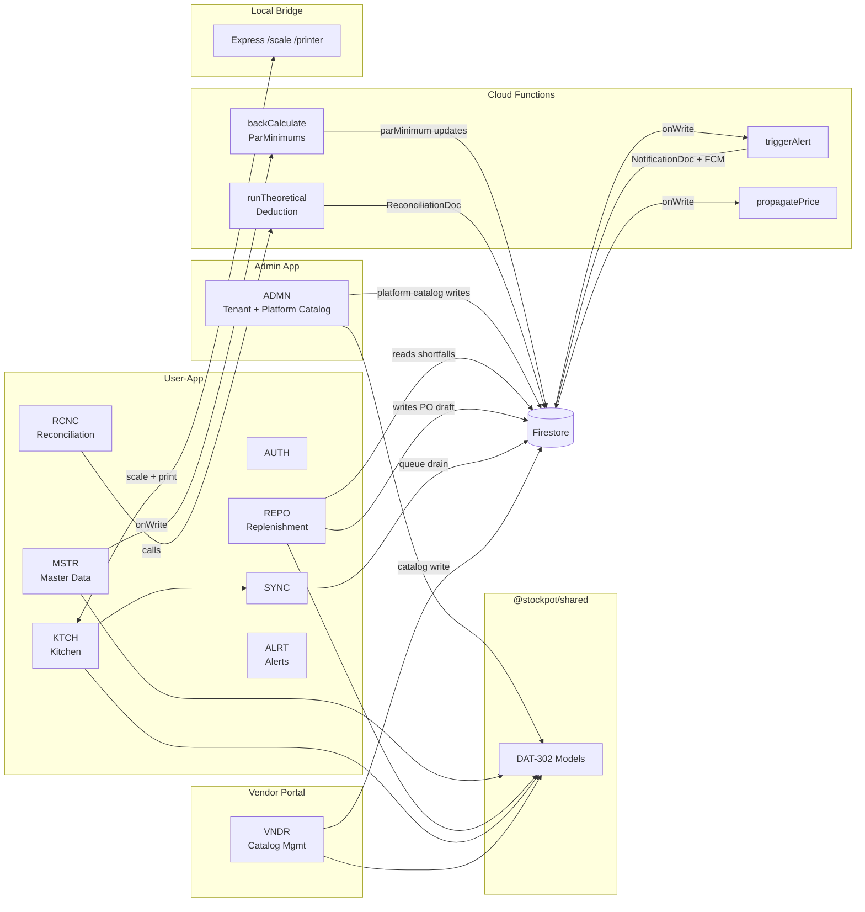
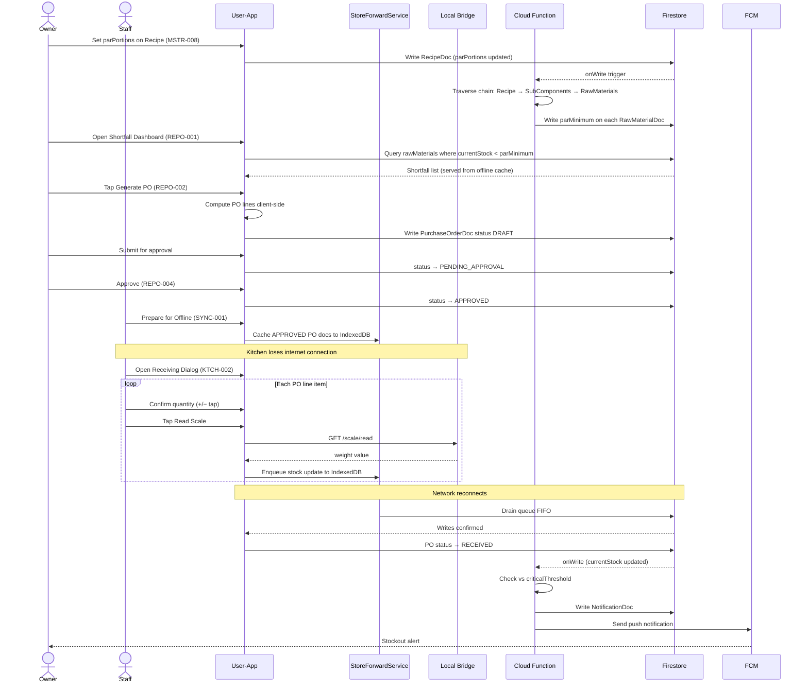

# Architecture Blueprint: StockPot

## 1. Document Header

| Field | Details |
| :--- | :--- |
| **Document Title** | StockPot — Architecture Blueprint |
| **Version** | 1.0 |
| **Status** | Draft |
| **Date** | April 15, 2026 |
| **Owner** | Watson (Architect) |
| **References** | PRD.md v1.0, ProjectBrief.md v1.1, CONSTRAINTS.md |

### Revision History

| Version | Date | Author | Summary |
| :--- | :--- | :--- | :--- |
| 1.0 | April 15, 2026 | Watson | Initial architecture from PRD v1.0. Resolves BRK-1 through BRK-5 and DEC-1 through DEC-4. Three-app platform: Admin (4200), User-App (4400), Vendor Portal (4600). New: `/local-bridge/` Node.js Express server (3500). |

---

## 2. System Overview

StockPot is a three-sided SaaS platform for SMB restaurants in the Philippines. The system is built on three Angular 21 applications — **Admin** (platform operator dashboard), **User-App** (restaurant operations PWA), and **Vendor Portal** (supplier self-service) — all backed by a single Firebase project providing Auth, Firestore, Cloud Functions, Storage, and Cloud Messaging. A fourth process, the **Local Hardware Bridge**, is a lightweight Node.js Express server that runs on-premise in the kitchen, proxying communication between the User-App PWA and physical weighing scales and thermal printers. The bridge operates entirely on the local network; it has no cloud dependency and no Firebase integration.

All application state in the Angular apps is managed through Angular 21 Signals exclusively. Firebase Auth state is registered once per app via `onAuthStateChanged` in `AppComponent` and surfaced through a singleton `CoreService` signal; no component, guard, or service queries Firebase Auth directly. Firestore access is scoped strictly to the authenticated user's tenant via Firestore Security Rules — cross-tenant reads are structurally impossible at the rule level, not just by application code convention. Platform-level data (UoM library, ingredient catalog, supplier network) lives in top-level platform collections readable by all authenticated users but writable only by users holding the `platform_admin` Firebase Auth custom claim.

All Firestore data models conform to the DAT-302 pattern: every model file in `projects/shared/src/models/` exports `SCHEMA_VERSION` + a `Doc` interface + `serialize()` and `deserialize()` functions. No `null` is ever written to Firestore; optional fields are conditionally spread using `...(value ? { field: value } : {})`. The `projects/shared` Angular library, importable as `@stockpot/shared`, is the single canonical source of truth for all model definitions — model interfaces must not be duplicated inside individual app `src/` folders. The `functions/src/models/` folder retains minimal interface copies for server-side type safety but must remain structurally consistent with the shared library.

---

## 3. Technology Stack

| Tool / Library / Service | Version | Purpose | Constraint Reference |
| :--- | :--- | :--- | :--- |
| Angular | 21 | Frontend framework for all three apps | CONSTRAINTS.md §Angular |
| Angular CDK + Material | 21 | UI component library | CONSTRAINTS.md §Styling |
| Tailwind CSS | 4 | Layout and spacing utilities | CONSTRAINTS.md §Styling |
| Angular Fire | Latest | Firebase SDK for Angular (AngularFire) | CONSTRAINTS.md §Architecture |
| Firebase Auth | — | Identity for all three apps | CONSTRAINTS.md §Auth |
| Firebase Firestore | — | Primary multi-tenant document store | CONSTRAINTS.md §Architecture |
| Firebase Cloud Functions | v6 (Node.js 22) | Server-side compute, Firestore triggers | CONSTRAINTS.md §Architecture |
| Firebase Storage | — | CSV uploads (RCNC), receipt slip assets | CONSTRAINTS.md §Architecture |
| Firebase Cloud Messaging (FCM) | — | PWA push notifications (ALRT-004) | PRD §NFR |
| TypeScript | Latest (strict mode) | All application code | CONSTRAINTS.md Golden Rule #1 |
| Node.js | 22 | Cloud Functions runtime + local-bridge server | CONSTRAINTS.md Golden Rule #1 |
| ESM modules | — | All Node.js / TypeScript server code | CONSTRAINTS.md Golden Rule #1 |
| `serialport` npm package | Latest stable | Serial/USB scale communication (HWBR-002) | PRD §HWBR |
| `node-thermal-printer` | Latest stable | Thermal printer output (HWBR-003) | PRD §HWBR |
| Angular Tabler Icons | — | Icon system across all apps | copilot-instructions.md |
| `@ngx-translate/core` | — | i18n support | copilot-instructions.md |
| `ngx-scrollbar` | — | Custom scrollbar styling | copilot-instructions.md |
| `ng-apexcharts` | — | Charts on Admin dashboard | copilot-instructions.md |
| Playwright + Chromium | Latest | E2E testing | CONSTRAINTS.md (Testing) |
| Jasmine + Karma | — | Unit testing | CONSTRAINTS.md (Testing) |
| Firebase Emulators | — | Local development backend | MONOREPO USE GUIDE.md |
| `npm` | — | Package management | CONSTRAINTS.md Golden Rule #4 |
| Netlify | — | Deployment target (SPA redirect) | netlify.toml |

---

## 4. Monorepo Structure

```
stockpot/
├── projects/
│   ├── admin/                    # Port 4200 — Platform operator dashboard
│   │   ├── src/
│   │   │   ├── app/
│   │   │   │   ├── layouts/      #   FullComponent + BlankComponent
│   │   │   │   ├── pages/
│   │   │   │   │   ├── auth/     #   ADMN-001 login
│   │   │   │   │   ├── tenants/  #   ADMN-002, ADMN-003
│   │   │   │   │   ├── catalog/  #   ADMN-005 through ADMN-009
│   │   │   │   │   └── dashboard/#   ADMN-004
│   │   │   │   ├── services/     #   TenantService, PlatformCatalogService
│   │   │   │   ├── material.module.ts
│   │   │   │   ├── app.config.ts
│   │   │   │   └── app.routes.ts
│   │   │   ├── index.html
│   │   │   ├── main.ts
│   │   │   └── styles.scss
│   │   ├── tsconfig.app.json
│   │   ├── tsconfig.json
│   │   └── tsconfig.spec.json
│   │
│   ├── user-app/                 # Port 4400 — Restaurant subscriber PWA
│   │   ├── src/
│   │   │   ├── app/
│   │   │   │   ├── layouts/      #   FullLayout (authenticated), BlankLayout (auth)
│   │   │   │   ├── pages/
│   │   │   │   │   ├── auth/     #   AUTH-001, AUTH-003, AUTH-004
│   │   │   │   │   ├── master-data/ # MSTR-001 through MSTR-008
│   │   │   │   │   ├── replenishment/ # REPO-001 through REPO-005
│   │   │   │   │   ├── kitchen/ #   KTCH-001 through KTCH-005
│   │   │   │   │   ├── reconciliation/ # RCNC-001 through RCNC-005
│   │   │   │   │   └── alerts/  #   ALRT-001 through ALRT-004
│   │   │   │   ├── services/     #   CoreService, RestaurantService, StoreForwardService
│   │   │   │   ├── guards/       #   auth.guard.ts, role.guard.ts (AUTH-002)
│   │   │   │   ├── material.module.ts
│   │   │   │   ├── app.config.ts
│   │   │   │   └── app.routes.ts
│   │   │   ├── public/           #   ngsw-config.json, icons (PWA assets)
│   │   │   ├── index.html
│   │   │   ├── main.ts
│   │   │   └── styles.scss
│   │   ├── tsconfig.app.json
│   │   ├── tsconfig.json
│   │   └── tsconfig.spec.json
│   │
│   ├── vendor-app/               # Port 4600 — Supplier Portal (new)
│   │   ├── src/
│   │   │   ├── app/
│   │   │   │   ├── layouts/      #   FullLayout + BlankLayout (minimal)
│   │   │   │   ├── pages/
│   │   │   │   │   ├── auth/     #   VNDR-001 login / profile setup
│   │   │   │   │   ├── catalog/  #   VNDR-002, VNDR-003, VNDR-004
│   │   │   │   │   └── orders/   #   VNDR-005 incoming POs
│   │   │   │   ├── services/     #   VendorCoreService, CatalogService
│   │   │   │   ├── material.module.ts
│   │   │   │   ├── app.config.ts
│   │   │   │   └── app.routes.ts
│   │   │   ├── index.html
│   │   │   ├── main.ts
│   │   │   └── styles.scss
│   │   ├── tsconfig.app.json
│   │   ├── tsconfig.json
│   │   └── tsconfig.spec.json
│   │
│   └── shared/                   # Angular library — @stockpot/shared
│       ├── src/
│       │   ├── index.ts          #   Public API barrel export
│       │   └── models/           #   ALL Firestore Doc interfaces (DAT-302)
│       │       ├── restaurant.model.ts         # v2 — adds status
│       │       ├── app-user.model.ts           # v1 — manager role
│       │       ├── subscription.model.ts
│       │       ├── payment-gateway.interface.ts
│       │       ├── vendor.model.ts             # v2 — RestaurantSupplierDoc
│       │       ├── raw-material.model.ts       # v2 — adds parMinimum, criticalThreshold
│       │       ├── sub-component.model.ts
│       │       ├── recipe.model.ts             # v2 — adds parPortions
│       │       ├── user-profile.model.ts       # legacy — see §6 note
│       │       ├── purchase-order.model.ts     # new
│       │       ├── platform-vendor.model.ts    # new
│       │       ├── vendor-catalog-item.model.ts# new
│       │       ├── platform-uom.model.ts       # new
│       │       ├── platform-ingredient.model.ts# new
│       │       ├── reconciliation.model.ts     # new
│       │       ├── alert-config.model.ts       # new
│       │       └── platform-admin-user.model.ts# new
│       ├── tsconfig.json
│       └── tsconfig.spec.json
│
├── local-bridge/                 # Port 3500 — Node.js Express hardware bridge (new)
│   ├── package.json
│   ├── tsconfig.json
│   └── src/
│       ├── index.ts              #   Express server entry point
│       ├── routes/
│       │   ├── health.route.ts   #   GET /health
│       │   ├── scale.route.ts    #   GET /scale/read  (HWBR-002)
│       │   └── printer.route.ts  #   POST /printer/slip (HWBR-003)
│       └── adapters/
│           ├── scale.adapter.ts  #   serialport abstraction
│           └── printer.adapter.ts#   node-thermal-printer abstraction
│
├── functions/                    # Firebase Cloud Functions
│   ├── package.json
│   ├── tsconfig.json
│   └── src/
│       ├── index.ts              #   Function registrations
│       ├── handlers/
│       │   ├── back-calculation.handler.ts  # MSTR-008
│       │   ├── deduction.handler.ts         # RCNC-002
│       │   ├── alert.handler.ts             # ALRT-001, ALRT-002
│       │   └── price-propagation.handler.ts # VNDR-003
│       └── models/               #   Minimal Doc interfaces (no serialize/deserialize)
│
├── environments/                 # Shared Firebase config per deployment target
├── e2e/                          # Playwright E2E tests
├── emulator-data/                # Firebase emulator snapshot
├── docs/                         # Documentation
│   ├── context/                  #   Living docs: PRD, Architecture, CONSTRAINTS, DECISION_LOG
│   ├── stories/                  #   54 user story files (10 module folders)
│   └── testing/                  #   Test strategy and registry
└── scripts/                      # Build and deployment utilities
```

### Path Alias

All Angular apps import shared models via the workspace path alias:

```typescript
import { RestaurantDoc, deserializeRestaurant } from '@stockpot/shared';
```

This alias resolves to `projects/shared/src/index.ts` via the `paths` entry in root `tsconfig.json`. No model definitions are duplicated in app-level `src/` folders.

---

## 5. Module Breakdown

### AUTH — User-App Authentication & Onboarding
- **App:** `projects/user-app`
- **Angular Components:** `LoginPageComponent`, `SetupWizardComponent`, `ProfilePageComponent`
- **Angular Services:** `CoreService` (auth signal), `RestaurantService` (setup wizard writes)
- **Angular Guards:** `authGuard` (route-level auth check), `roleGuard` (role-based route access per AUTH-002)
- **Firestore Collections:** `restaurants/{restaurantId}` (wizard create), `restaurants/{restaurantId}/users/{uid}` (user lookup)
- **Cloud Functions:** none
- **Pattern:** `onAuthStateChanged` registered once in `AppComponent`. On successful login, `CoreService` resolves `AppUser` from Firestore and caches it as a Signal. First-run wizard triggers when `CoreService.restaurant()` is null after auth resolves.

---

### ADMN — Admin App (Platform Operator)
- **App:** `projects/admin`
- **Angular Components:** `AdminLoginComponent`, `TenantListComponent`, `TenantDetailComponent`, `SubscriptionFormComponent`, `DashboardComponent`, `UomLibraryComponent`, `IngredientCatalogComponent`, `SupplierNetworkComponent`, `SupplierCatalogViewComponent`, `IngredientSupplierMappingComponent`
- **Angular Services:** `AdminCoreService`, `TenantService`, `PlatformCatalogService`, `SubscriptionService`
- **Firestore Collections:** `restaurants/*`, `subscriptions/*`, `adminUsers/{uid}`, `platform_uom/*`, `platform_ingredients/*`, `vendors/{vendorId}`
- **Cloud Functions:** `getDashboardAggregates` (HTTP callable), `assignVendorCustomClaim`, `assignAdminCustomClaim`
- **Pattern:** `platform_admin` custom claim required for all platform collection writes. Angular guards enforce routing; Firestore Security Rules enforce data access.

---

### MSTR — Restaurant Master Data Setup
- **App:** `projects/user-app`
- **Angular Components:** `UomSelectorComponent`, `RawMaterialListComponent`, `RawMaterialFormComponent`, `SupplierLinkComponent`, `SubComponentFormComponent`, `RecipeFormComponent`, `IngredientChainMapComponent`, `ParLevelConfigComponent`
- **Angular Services:** `MasterDataService`, `CostService`
- **Firestore Collections:** `restaurants/{restaurantId}/rawMaterials/*`, `restaurants/{restaurantId}/subComponents/*`, `restaurants/{restaurantId}/recipes/*`, `restaurants/{restaurantId}/suppliers/*`, `platform_uom/*` (read), `platform_ingredients/*` (read)
- **Cloud Functions:** `backCalculateParMinimums` (Firestore onWrite on `recipes/{recipeId}`)
- **Pattern:** Two-tier display badge: `platformIngredientRef` present → "Platform" badge; absent → "Custom" badge. `CostService` handles client-side theoretical cost display. `backCalculateParMinimums` handles server-side par minimum computation for consistency.

---

### REPO — Smart PO & Replenishment Engine
- **App:** `projects/user-app`
- **Angular Components:** `ShortfallDashboardComponent`, `PoGeneratorComponent`, `PoEditorComponent`, `PoApprovalComponent`, `PoHistoryComponent`
- **Angular Services:** `ReplenishmentService`
- **Firestore Collections:** `restaurants/{restaurantId}/rawMaterials/*` (read), `restaurants/{restaurantId}/purchaseOrders/*` (write), `restaurants/{restaurantId}/suppliers/*` (read), `vendors/{vendorId}/catalog/*` (read for live pricing)
- **Cloud Functions:** none
- **Pattern:** Auto-PO generation is client-side only — computed from Firestore offline cache, writes one `PurchaseOrderDoc`. Guarantees < 3s NFR without cold-start risk.

---

### KTCH — Kitchen Execution Hub
- **App:** `projects/user-app`
- **Angular Components:** `KitchenHomeComponent`, `ReceivingDialogComponent`, `PrepBatchDialogComponent`, `StockAdjustmentDialogComponent`, `SpotCountDialogComponent`
- **Angular Services:** `KitchenService`, `StoreForwardService`, `HardwareBridgeService`
- **Firestore Collections:** `restaurants/{restaurantId}/rawMaterials/*` (stock updates via SFS), `restaurants/{restaurantId}/purchaseOrders/*` (status updates)
- **Cloud Functions:** none
- **Pattern:** All writes pass through `StoreForwardService`. `HardwareBridgeService` calls bridge at configured URL (HWBR-004); bridge is optional — all workflows proceed manually if bridge unavailable. Minimum 44px tap targets; dialog-driven only.

---

### SYNC — Offline Sync
- **App:** `projects/user-app`
- **Angular Components:** `SyncStatusChipComponent`, `OfflineBannerComponent`
- **Angular Services:** `StoreForwardService`
- **Firestore Collections:** `restaurants/{restaurantId}/rawMaterials/*` (queue drain), `restaurants/{restaurantId}/syncConflicts/*` (conflict log)
- **Cloud Functions:** none
- **Pattern:** `StoreForwardService` exposes `queueDepth` and `syncStatus` as Angular Signals. Queue drains FIFO. **Conflict resolution: last-write-wins** (see ADL-005). When offline write timestamp < document `updatedAt`, conflict logged to `syncConflicts/` and write proceeds. Manager can review conflicts via KTCH-004.

---

### HWBR — Local Hardware Bridge
- **Process:** `local-bridge/` — Node.js 22 Express, port 3500
- **Not an Angular app.**
- **HTTP Endpoints:** `GET /health`, `GET /scale/read`, `POST /printer/slip`, `GET /config`
- **Runtime Deps:** `serialport`, `node-thermal-printer`
- **CORS:** `ALLOWED_ORIGIN` env var (default `http://localhost:4400`)
- **Deployment:** Runs on the same machine as the browser accessing the User-App. See ADL-006 for CORS / deployment model decision.

---

### VNDR — Vendor / Supplier Portal
- **App:** `projects/vendor-app` (port 4600)
- **Angular Components:** `VendorLoginComponent`, `VendorProfileComponent`, `CatalogListComponent`, `PriceEditComponent`, `AvailabilityToggleComponent`, `IncomingPoListComponent`
- **Angular Services:** `VendorCoreService`, `VendorCatalogService`
- **Firestore Collections:** `vendors/{vendorId}` (own doc), `vendors/{vendorId}/catalog/*`, `restaurants/{restaurantId}/purchaseOrders/*` (read for incoming POs)
- **Cloud Functions:** `propagateVendorPriceUpdate` (Firestore onWrite on `vendors/{vendorId}/catalog/{itemId}`)
- **Auth Pattern:** Email-link invite (passwordless). On first login, vendor prompted to link email/password via `linkWithEmailAndPassword` for recurring access. `vendorId` custom claim scopes Firestore rules.

---

### RCNC — Reconciliation & Variance Auditing
- **App:** `projects/user-app`
- **Angular Components:** `CsvUploadComponent`, `DeductionReviewComponent`, `CountSheetComponent`, `VarianceDrillDownComponent`, `VarianceTrendComponent`
- **Angular Services:** `ReconciliationService`
- **Firestore Collections:** `restaurants/{restaurantId}/reconciliations/*` (write), `restaurants/{restaurantId}/recipes/*` (read), `restaurants/{restaurantId}/rawMaterials/*` (read)
- **Firebase Storage:** CSV uploaded to Storage first; Cloud Function reads from Storage path
- **Cloud Functions:** `runTheoreticalDeduction` (HTTP callable)
- **Pattern:** Run is idempotent — re-running same `dateKey` overwrites previous `ReconciliationDoc`.

---

### ALRT — Alert Engine
- **App:** `projects/user-app` (config UI)
- **Angular Components:** `AlertConfigComponent`, `NotificationBellComponent`, `AlertListComponent`, `PushOptInComponent`
- **Angular Services:** `AlertService`
- **Firestore Collections:** `restaurants/{restaurantId}/alertConfig/*` (write), `restaurants/{restaurantId}/notifications/*` (read)
- **Cloud Functions:** `triggerStockoutAlert` (onWrite `rawMaterials/{mId}`), `triggerBudgetAlert` (onWrite `purchaseOrders/{poId}`)
- **FCM:** Tokens stored at `restaurants/{restaurantId}/users/{uid}/fcmTokens/{tokenId}`. Functions call `messaging().send()`.

---

## 6. Data Models

All models live in `projects/shared/src/models/`. Import via `@stockpot/shared`. All follow DAT-302 pattern. No `null` written to Firestore.

---

### `restaurants/{restaurantId}` — `RestaurantDoc` **v2**

```typescript
export const RESTAURANT_SCHEMA_VERSION = 2;

export interface RestaurantDoc {
  _schemaVersion: number;
  name: string;
  address: string;
  planTier: 'starter' | 'growth' | 'enterprise';
  timezone: string;     // IANA — default 'Asia/Manila'
  currency: string;     // ISO 4217 — default 'PHP'
  createdAt: string;    // ISO 8601
  status: 'active' | 'suspended';  // NEW v2 — drives ADMN-002 + Security Rules
}
```

**Migration v1→v2:** `status` defaults to `'active'` when absent.

---

### `restaurants/{restaurantId}/users/{uid}` — `AppUserDoc` v1

```typescript
export type AppUserRole = 'owner' | 'manager' | 'staff';

export interface AppUserDoc {
  _schemaVersion: number;
  uid: string;
  restaurantId: string;
  name: string;
  email: string;
  role: AppUserRole;
  photoURL?: string;
}
```

---

### `restaurants/{restaurantId}/rawMaterials/{materialId}` — `RawMaterialDoc` **v2**

```typescript
export const RAW_MATERIAL_SCHEMA_VERSION = 2;

export interface RawMaterialDoc {
  _schemaVersion: number;
  name: string;
  unit: string;
  currentStock: number;
  parLevel: number;               // legacy manual threshold
  parMinimum: number;             // NEW v2 — computed by MSTR-008 Cloud Function
  unitCost: number;
  vendorId?: string;
  category?: string;
  platformIngredientRef?: string; // NEW v2 — links to platform_ingredients/ if platform-sourced
  criticalThreshold?: number;     // NEW v2 — alert fires at or below this qty (ALRT-001)
}
```

**Migration v1→v2:** `parMinimum` defaults to `parLevel`. `criticalThreshold` omitted until configured.

---

### `restaurants/{restaurantId}/subComponents/{componentId}` — `SubComponentDoc` v1

No structural changes. See `sub-component.model.ts`.

---

### `restaurants/{restaurantId}/recipes/{recipeId}` — `RecipeDoc` **v2**

```typescript
export const RECIPE_SCHEMA_VERSION = 2;

export interface RecipeRawIngredient {
  rawMaterialId: string;
  qty: number;           // per portion, in raw material's unit
}

export interface RecipeSubComponentIngredient {
  subComponentId: string;
  qty: number;           // per portion, in sub-component's yieldUnit
}

export interface RecipeDoc {
  _schemaVersion: number;
  name: string;
  sellingPrice: number;
  portionSize: number;
  portionUnit: string;
  rawIngredients: RecipeRawIngredient[];
  subComponentIngredients: RecipeSubComponentIngredient[];
  theoreticalCost: number;
  actualCost: number;
  parPortions: number;   // NEW v2 — minimum portions target; drives MSTR-008
  category?: string;
  notes?: string;
  isActive: boolean;
}
```

**Migration v1→v2:** `parPortions` defaults to `0`.  
**Back-calculation formula:** `parMinimum(material) = parPortions × qty_per_portion` for direct ingredients; for sub-component chains: `parPortions × (subComponentQty / subComponent.yieldQty) × rawMaterialQty / subComponent.yieldPercent`.

---

### `restaurants/{restaurantId}/suppliers/{supplierId}` — `RestaurantSupplierDoc` **v2**

Formerly `VendorDoc` at `restaurants/{rId}/vendors/`. Path renamed to `suppliers/` to eliminate collision with top-level `vendors/{vendorId}`.

```typescript
export const RESTAURANT_SUPPLIER_SCHEMA_VERSION = 2;

export interface RestaurantSupplierDoc {
  _schemaVersion: number;
  name: string;
  contactPerson?: string;
  phone?: string;
  email?: string;
  leadTimeDays: number;
  notes?: string;
  isCustom: boolean;           // NEW v2 — false = platform-sourced, true = user-created
  platformVendorRef?: string;  // NEW v2 — ID in vendors/ when platform-sourced
}
```

**Migration v1→v2:** `isCustom` defaults to `true`. `platformVendorRef` omitted for all existing records.

---

### `restaurants/{restaurantId}/purchaseOrders/{poId}` — `PurchaseOrderDoc` **v1 (new)**

```typescript
export const PURCHASE_ORDER_SCHEMA_VERSION = 1;

export type PurchaseOrderStatus =
  | 'DRAFT' | 'PENDING_APPROVAL' | 'APPROVED' | 'RECEIVED' | 'CANCELLED';

export type PriceSource = 'platform' | 'manual';

export interface PurchaseOrderLineItem {
  rawMaterialId: string;
  rawMaterialName: string;   // denormalized for offline display
  supplierId: string;
  supplierName: string;      // denormalized
  unit: string;
  quantityOrdered: number;
  unitPrice: number;
  priceSource: PriceSource;  // drives REPO-002 AC #3 price source label
  quantityReceived?: number; // populated on RECEIVED
}

export interface PurchaseOrderDoc {
  _schemaVersion: number;
  restaurantId: string;
  status: PurchaseOrderStatus;
  createdBy: string;         // uid
  generatedAt: string;       // ISO 8601
  approvedBy?: string;       // uid
  approvedAt?: string;
  receivedAt?: string;
  lineItems: PurchaseOrderLineItem[];
  totalAmount: number;       // cached sum — (qty × unitPrice) per line
  notes?: string;
}
```

**Index:** Composite index on `restaurantId + status` for KTCH-001 task list queries.

---

### `restaurants/{restaurantId}/reconciliations/{dateKey}` — `ReconciliationDoc` **v1 (new)**

`dateKey` format: `YYYY-MM-DD`.

```typescript
export const RECONCILIATION_SCHEMA_VERSION = 1;

export interface ReconciliationLineItem {
  rawMaterialId: string;
  rawMaterialName: string;
  theoreticalConsumption: number;
  unit: string;
  actualPhysicalCount?: number;
  variancePercent?: number;  // (actual - theoretical) / theoretical × 100
  isFlagged: boolean;        // |variancePercent| > threshold
}

export interface ReconciliationDoc {
  _schemaVersion: number;
  restaurantId: string;
  dateKey: string;
  runAt: string;             // ISO 8601 — last run; idempotent re-run overwrites
  portionsSoldByRecipe: Record<string, number>; // recipeId → qty sold
  lineItems: ReconciliationLineItem[];
  unmatchedPosItems: string[];
  status: 'pending_review' | 'confirmed';
}
```

---

### `restaurants/{restaurantId}/alertConfig/{materialId}` — `AlertConfigDoc` **v1 (new)**

```typescript
export const ALERT_CONFIG_SCHEMA_VERSION = 1;

export interface AlertConfigDoc {
  _schemaVersion: number;
  rawMaterialId: string;
  criticalThreshold: number;
  unit: string;
  enabled: boolean;
  lastFiredAt?: string;   // prevents repeat fires during same breach period
}
```

---

### `restaurants/{restaurantId}/notifications/{notificationId}` — `NotificationDoc` **v1 (new)**

Written by Cloud Functions only.

```typescript
export const NOTIFICATION_SCHEMA_VERSION = 1;

export type NotificationType = 'stockout' | 'over_budget' | 'po_approved' | 'sync_conflict';

export interface NotificationDoc {
  _schemaVersion: number;
  restaurantId: string;
  type: NotificationType;
  title: string;
  body: string;
  createdAt: string;       // ISO 8601
  readAt?: string;         // omitted until read
  relatedDocId?: string;   // materialId, poId, etc.
}
```

---

### `vendors/{vendorId}` — `PlatformVendorDoc` **v1 (new)**

Top-level collection. Created by Admin app (ADMN-007). Writable only by `platform_admin` claim.

```typescript
export const PLATFORM_VENDOR_SCHEMA_VERSION = 1;

export interface PlatformVendorDoc {
  _schemaVersion: number;
  name: string;
  description?: string;
  contactEmail?: string;
  contactPhone?: string;
  address?: string;
  isActive: boolean;
  invitedVendorUid?: string;  // Firebase Auth UID of linked vendor rep (VNDR-001)
  createdAt: string;
}
```

---

### `vendors/{vendorId}/catalog/{itemId}` — `VendorCatalogItemDoc` **v1 (new)**

```typescript
export const VENDOR_CATALOG_ITEM_SCHEMA_VERSION = 1;

export interface VendorCatalogItemDoc {
  _schemaVersion: number;
  vendorId: string;
  platformIngredientRef: string;  // links to platform_ingredients/{ingredientId}
  unit: string;
  currentPrice: number;           // PHP
  isAvailable: boolean;
  updatedAt: string;
}
```

**Subcollection:** `priceHistory/{historyId}` — append-only, written by `propagateVendorPriceUpdate` function.

---

### `platform_uom/{uomId}` — `PlatformUomDoc` **v1 (new)**

```typescript
export const PLATFORM_UOM_SCHEMA_VERSION = 1;

export interface PlatformUomDoc {
  _schemaVersion: number;
  name: string;             // e.g. 'Kilogram'
  abbreviation: string;     // e.g. 'kg'
  baseUnit?: string;        // e.g. 'g'
  conversionFactor?: number;// e.g. 1000 (1 kg = 1000 g)
  archived: boolean;
}
```

---

### `platform_ingredients/{ingredientId}` — `PlatformIngredientDoc` **v1 (new)**

```typescript
export const PLATFORM_INGREDIENT_SCHEMA_VERSION = 1;

export interface PlatformIngredientDoc {
  _schemaVersion: number;
  name: string;
  category?: string;      // e.g. 'Proteins', 'Dry Goods', 'Dairy'
  defaultUomRef?: string; // ID from platform_uom/
  description?: string;
  archived: boolean;
}
```

---

### `adminUsers/{uid}` — `PlatformAdminUserDoc` **v1 (new)**

```typescript
export const PLATFORM_ADMIN_USER_SCHEMA_VERSION = 1;

export interface PlatformAdminUserDoc {
  _schemaVersion: number;
  uid: string;
  name: string;
  email: string;
  photoURL?: string;
}
```

> **Note:** `UserProfileDoc` (`user-profile.model.ts`, path `users/{uid}`) is the legacy scaffold model. Admin app users are stored at `adminUsers/{uid}`. The `users/{uid}` path is not used by any StockPot feature module and is deprecated pending scaffold cleanup.

---

### `subscriptions/{subscriptionId}` — `SubscriptionDoc` v1

No structural changes. See `subscription.model.ts`.

---

## 7. API & Integration Design

### Firebase Cloud Functions

| Function | Trigger | Input | Output | Auth |
| :--- | :--- | :--- | :--- | :--- |
| `backCalculateParMinimums` | Firestore onWrite — `restaurants/{rId}/recipes/{recipeId}` | `RecipeDoc` (after) | Writes `parMinimum` to affected `RawMaterialDoc`s | Server-side only |
| `runTheoreticalDeduction` | HTTP Callable | `{ restaurantId, dateKey, storageCsvPath }` | `{ lineItemCount, unmatchedCount, status }` | Authenticated — `owner` role |
| `triggerStockoutAlert` | Firestore onWrite — `restaurants/{rId}/rawMaterials/{mId}` | `RawMaterialDoc` (after) | Writes `NotificationDoc`; sends FCM | Server-side only |
| `triggerBudgetAlert` | Firestore onWrite — `restaurants/{rId}/purchaseOrders/{poId}` | `PurchaseOrderDoc` (after) | Writes `NotificationDoc`; sends FCM | Server-side only |
| `propagateVendorPriceUpdate` | Firestore onWrite — `vendors/{vId}/catalog/{itemId}` | `VendorCatalogItemDoc` (after) | Appends `priceHistory` entry | Server-side only |
| `getDashboardAggregates` | HTTP Callable | `{}` | `{ activeTenants, trialingTenants, totalRevenueMtd }` | `platform_admin` claim required |
| `assignVendorCustomClaim` | HTTP Callable | `{ uid, vendorId }` | `{ success: boolean }` | `platform_admin` claim required |
| `assignAdminCustomClaim` | HTTP Callable | `{ uid }` | `{ success: boolean }` | `platform_admin` claim required |

### Local Hardware Bridge HTTP Endpoints

| Endpoint | Method | Input | Output | Notes |
| :--- | :--- | :--- | :--- | :--- |
| `/health` | GET | — | `{ status: "ok", version: "1.0.0" }` | HWBR-001 |
| `/scale/read` | GET | `?port=COM3&baudRate=9600` | `{ weight: number, unit: string }` | HWBR-002 |
| `/printer/slip` | POST | `ReceivingSlipPayload` (JSON) | `{ printed: boolean }` | HWBR-003 |
| `/config` | GET | — | `{ availablePorts: string[] }` | HWBR-004 — port discovery |

---

## 8. Security Model

### Firebase Authentication Flows

| App | Auth Method | Custom Claim | Notes |
| :--- | :--- | :--- | :--- |
| Admin | Email / Password | `platform_admin: true` | Claim set via `assignAdminCustomClaim` function; first admin bootstrapped via Firebase Console |
| User-App | Email / Password | none | Tenant created by AUTH-003 setup wizard on first login |
| Vendor Portal | Email magic link (invite) | `vendorId: "<id>"` | First login via magic link; vendor prompted to link email/password via `linkWithEmailAndPassword` for future sessions |

### Firestore Security Rules Strategy

```
Helper functions:
  isPlatformAdmin()    → request.auth.token.platform_admin == true
  isActiveTenant(rId)  → get(/restaurants/$(rId)).data.status == 'active'
  isMember(rId)        → exists(/restaurants/$(rId)/users/$(request.auth.uid))
  isManager(rId)       → userRole(rId) == 'owner' || userRole(rId) == 'manager'
  isVendorOwner(vId)   → request.auth.token.vendorId == vId

Enforcement layers:
  platform_uom/, platform_ingredients/ — read: all authenticated; write: isPlatformAdmin()
  vendors/{vId}                        — read: all authenticated; write: isPlatformAdmin() || isVendorOwner(vId)
  vendors/{vId}/catalog/               — read: all authenticated; write: isVendorOwner(vId)
  adminUsers/                          — read/write: isPlatformAdmin()
  restaurants/{rId} (root doc)         — read/write: isPlatformAdmin() || (isMember(rId) && isActiveTenant(rId))
  restaurants/{rId}/users/             — read: isMember(rId); write: isPlatformAdmin() || own uid only
  restaurants/{rId}/rawMaterials/      — read: isMember(rId) && isActiveTenant(rId); write: isManager(rId) via SFS
  restaurants/{rId}/recipes/           — read: isMember(rId); write: owner role only
  restaurants/{rId}/purchaseOrders/    — read: isManager(rId); write: isManager(rId)
  subscriptions/                       — read: isPlatformAdmin() || owning restaurant; write: isPlatformAdmin()
```

### OWASP Top 10 Mitigations

| OWASP Risk | Mitigation |
| :--- | :--- |
| A01 Broken Access Control | Firestore Security Rules are the enforcement layer — Angular guards are UI-only. Rules unit-tested with Firestore Emulator before every production deploy. |
| A02 Cryptographic Failures | Firebase Auth handles all password hashing and JWT signing. No credentials stored in Firestore. No sensitive data in Angular environment files checked into git. |
| A03 Injection | Firestore document store — no SQL surface. `serialize()` functions enumerate fields explicitly; no spread of raw user-supplied objects. |
| A04 Insecure Design | Multi-tenancy enforced at database rules level. Three apps are separate Firebase Hosting targets. Suspension via `status` field enforced server-side. |
| A05 Security Misconfiguration | Firebase config environment files use emulator keys locally; production keys via Firebase Hosting runtime environment. `.gitignore` excludes `.env` files. |
| A06 Vulnerable Components | `npm audit` in CI pipeline. `allowedCommonJsDependencies` in `angular.json` reviewed before addition. |
| A07 Auth & Session Failures | Firebase Auth manages sessions and token refresh. `signOut()` clears local state and CoreService signal. |
| A08 Software & Data Integrity | `SCHEMA_VERSION` + `deserialize()` migration gates guard against corrupt legacy data. Cloud Function inputs checked with TypeScript strict types before Firestore writes. |
| A09 Security Logging & Monitoring | Firebase Security Rules audit logs enabled in production. Cloud Function errors logged to Cloud Logging. `alertConfig.lastFiredAt` provides alert audit trail. |
| A10 SSRF | Local Bridge communicates only with local serial ports. No proxy to external URLs. Bridge `ALLOWED_ORIGIN` restricts which browser origins may call it. |

---

## 9. System Diagrams

### Diagram A: System Context



---

### Diagram B: Module and Component Interactions



---

### Diagram C: Primary Data Flow — PO Generation to Receiving



---

## 10. Performance & Scalability

| NFR | Technical Strategy |
| :--- | :--- |
| **LCP ≤ 2.5s on Kitchen Home (4G)** | Lazy-loaded route modules for all non-kitchen routes. PWA service worker (`ngsw`) pre-caches Kitchen Home, Receiving, and Prep Batching. Firebase Hosting CDN with immutable asset hashing. |
| **Auto-PO < 3s for 50 items (REPO-002)** | Client-side computation from Firestore offline persistence cache. No Cloud Function call. Single Firestore write at completion. Target client-side: < 300ms. See ADL-004. |
| **Deduction run < 10s for 500 POS lines (RCNC-002)** | Cloud Function minimum instances = 1 (warm — eliminates cold-start). Chain traversal is in-memory from cached Firestore reads. Estimate: 3–6s at warm start for 500 lines. |
| **Zero data loss (offline receiving)** | `StoreForwardService` writes to IndexedDB before acknowledging to the UI. Persists across full app restart. Queue drain retries with exponential backoff. |
| **10,000+ restaurant tenants** | `restaurants/{restaurantId}` root collection — no structural limit. Platform collections (`platform_uom/`, `platform_ingredients/`) are read-heavy; Firestore client-side caching avoids repeated reads. No `collectionGroup` queries on tenant sub-collections. |
| **Supplier price propagation < 60s** | `propagateVendorPriceUpdate` appends only a `priceHistory` entry — no fan-out to restaurant documents. Restaurants read live `catalog/` prices on next Shortfall Dashboard query. 60s target trivially achievable. |
| **Alert fires before service impact** | `triggerStockoutAlert` fires on `rawMaterials/{mId}` write (typically 1–5s latency). Operators configure `criticalThreshold` above zero (e.g., 1 day's supply buffer) to ensure proactive firing. `lastFiredAt` prevents duplicate alerts within same breach period. |
| **PWA installable (Android primary)** | `ngsw-config.json` in `user-app/public/`. Web App Manifest with `display: standalone`, 192×192 and 512×512 icons. iOS: `apple-mobile-web-app-capable` meta tag. |
| **Hardware bridge resilience** | Bridge is local-only with no Firebase dependency. `HardwareBridgeService` treats bridge as optional — all KTCH workflows proceed manually on bridge timeout (2s). Serial port auto-reconnect on device re-plug. |
