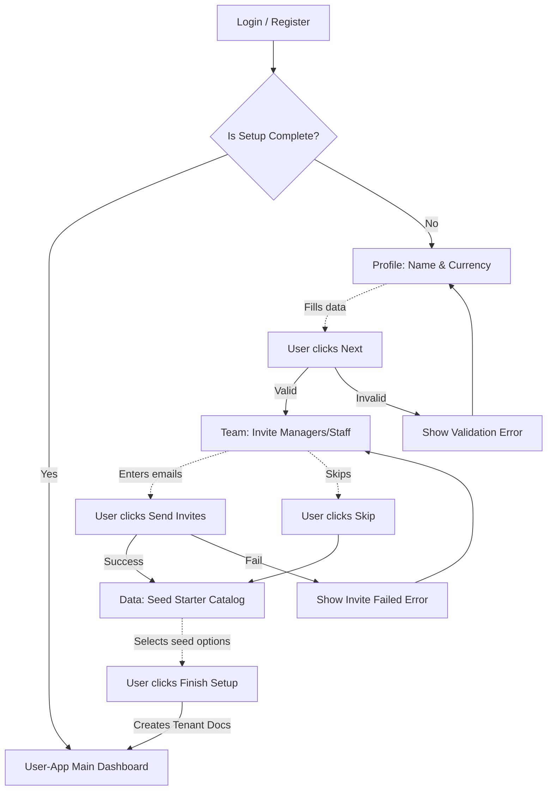
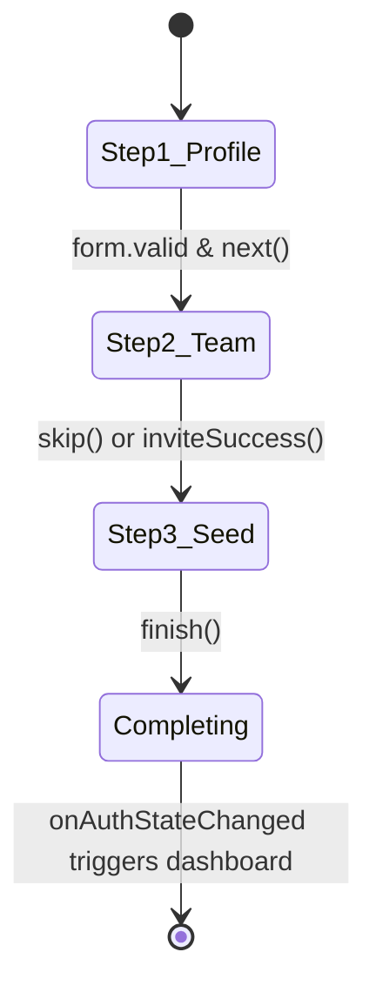

# UX Flow: Auth Setup Wizard (AUTH)

## 1. Full Navigation Flow

## 2. Happy Path Callout
**Primary Success Path:** A new Owner registers, is seamlessly routed into the `SetupWizard`, fills in a currency and restaurant name, inputs one manager's email, accepts the default starter catalog seed, and lands on the Main Dashboard completely provisioned.

## 3. State Machine (Form Progression)

## 4. Route Map
| Screen Node | Angular Route Path | Layout Wrapper | Auth Requirement |
| :--- | :--- | :--- | :--- |
| Login / Register | `projects/user-app` -> `/auth/login` | `BlankLayout` | Public |
| Setup Wizard | `projects/user-app` -> `/auth/setup` | `BlankLayout` | Authenticated (No tenant yet) |
| Dashboard | `projects/user-app` -> `/dashboard` | `FullLayout` | Authenticated + `owner` role |

## 5. Error & Edge Case Paths
- **Validation Failure (Step 1):** Missing restaurant name or currency blocks progression. Input border turns Red (`text-error`) with local validation hint.
- **Invite Delivery Failure (Step 2):** Backend rejects email format or Firebase triggers an error. Toast notification presented; user can resolve or use "Skip".
- **Network Disconnect (Step 3):** If connection drops right as tenant provisioning is called, the Setup Wizard catches the network error, prevents advancing, and displays an offline amber banner (`bg-accent`), preserving form state until connection restores.