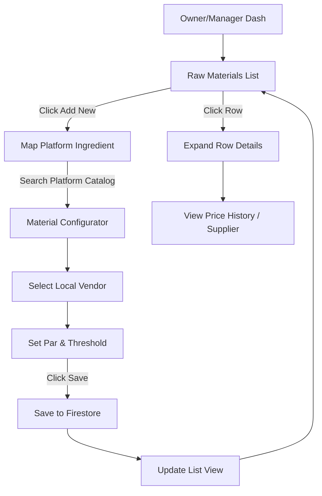
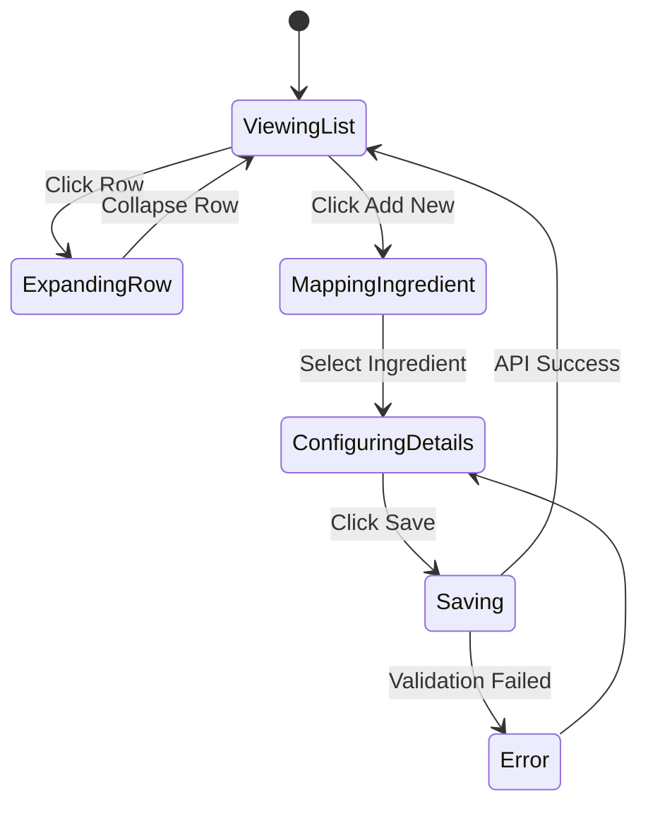

# UX Flow: Master Data - Raw Materials (MSTR)

## 1. Full Navigation Flow

## 2. Happy Path Callout
**Primary Success Path:** A restaurant owner maps "White Onions", selects their local supplier "FreshFarms", inputs their purchase price of "$2/Kg", sets a Par minimum of 10Kg, and clicks Save. The item instantly generates a localized `raw-material` configuration doc under their tenant ID.

## 3. State Machine 

## 4. Route Map
| Screen Node | Angular Route Path | Layout Wrapper | Auth Requirement |
| :--- | :--- | :--- | :--- |
| Raw Materials List | `projects/user-app` -> `/master-data/raw-materials` | `FullLayout` | `owner`, `manager` |
| View Material | `projects/user-app` -> `/master-data/raw-materials/{id}` | `FullLayout` | `owner`, `manager` |

## 5. Error & Edge Case Paths
- **Validation Errors:** Setting a "Critical Threshold" *higher* than the "Par Minimum". The Save button disables and the field highlights in red.
- **Offline Mode:** If offline while adding a new Master Material, the state is temporarily queued in the generic `StoreForwardService`. An amber banner warns the user it is unsynced.
- **Deleted Platform Ingredient:** If an ingredient is archived by Platform Admin, the `MSTR` screen renders it read-only for historical calculation purposes but prevents further restock mapping.