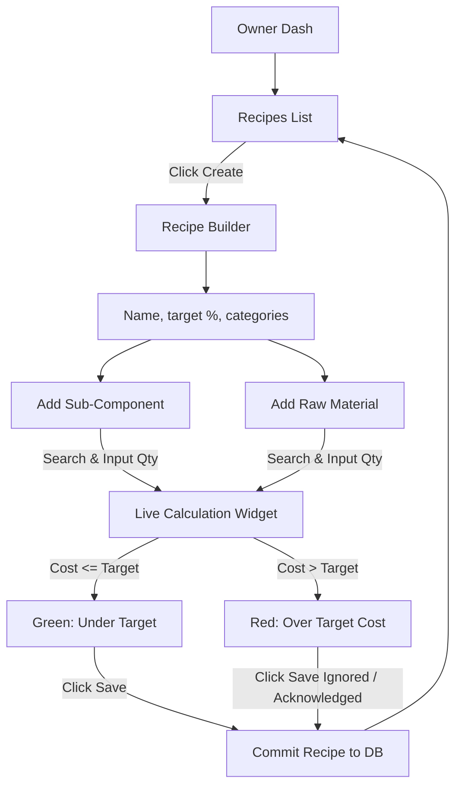
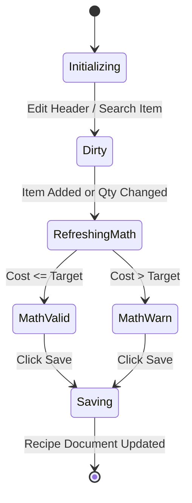

# UX Flow: Master Data - Recipes (MSTR)

## 1. Full Navigation Flow

## 2. Happy Path Callout
**Primary Success Path:** A Chef opens the Recipe Builder, names a dish, sets a 30% target food cost, searches for existing Sub-Components and Raw Materials using Autocomplete, types in the quantities (`0.25 L`, `150 g`), and watches the Theoretical Cost output accurately display under the 30% target. Finally, they click "Save Recipe".

## 3. State Machine (Builder Interaction)

## 4. Route Map
| Screen Node | Angular Route Path | Layout Wrapper | Auth Requirement |
| :--- | :--- | :--- | :--- |
| Recipes List | `projects/user-app` -> `/master-data/recipes` | `FullLayout` | `owner`, `manager` |
| Recipe Builder | `projects/user-app` -> `/master-data/recipes/builder` | `FullLayout` | `owner`, `manager` |

## 5. Error & Edge Case Paths
- **Infinite Recursion Protection:** Constructing a Recipe out of a Sub-Component that directly or indirectly references itself. Back-end/UI validation strictly refuses the addition with an `Error Alert (Red)`.
- **Unpriced Underlying Material:** If a raw material is added that lacks a mapped local supplier price, the Cost Calculations turn Amber/NA, stating "Missing Pricing Data". The recipe can be saved, but cannot accurately evaluate margin.
- **Currency/UoM Mismatch:** Adding an item requires conversion (e.g. buying Liters but recipe asks for Tablespoons). If UoM math conversion fails, field disables and signals error.