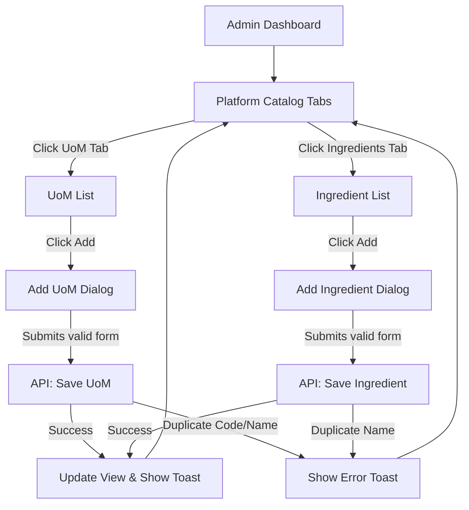
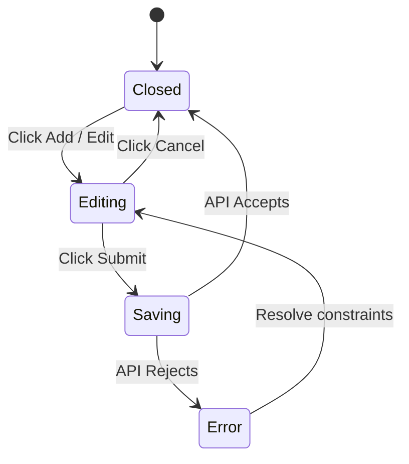

# UX Flow: Platform Catalog (ADMN)

## 1. Full Navigation Flow

## 2. Happy Path Callout
**Primary Success Path:** A platform administrator needs to append "Gallon" to the global units. They navigate to the Platform Catalog, remain on the UoM tab, hit "Add UoM", fill in the Name, Abbreviation ("Gal"), and Base Conversion Math (to ml), and save. The dialog closes and the list natively refreshes.

## 3. State Machine (Dialog Workflow)

## 4. Route Map
| Screen Node | Angular Route Path | Layout Wrapper | Auth Requirement |
| :--- | :--- | :--- | :--- |
| Admin Dashboard | `projects/admin` -> `/dashboard` | `FullComponent` | `platform_admin` claim |
| Platform Catalog | `projects/admin` -> `/catalog` | `FullComponent` | `platform_admin` claim |

## 5. Error & Edge Case Paths
- **Duplicate Document ID:** The platform prevents duplicate Base UoMs or Duplicate Master Ingredients. The Cloud Function / Firebase rule rejects the write. UI displays a Red (`bg-error`) toast notification: "Cannot create: Item already exists."
- **Network Failure Layout:** Buttons inside the modal disable and show inline spinners. If offline on submit, Firebase caches the write locally and the UI functions optimistically. A silent status sync pushes to the cloud immediately upon reconnection.