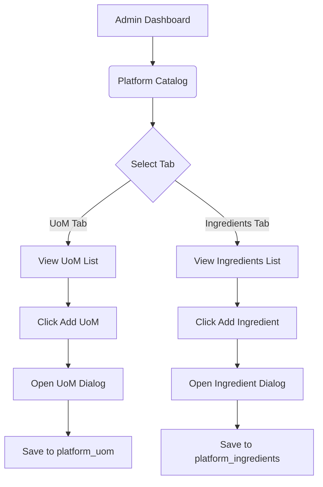

# Wireframe: Platform Catalog (ADMN)

## 1. Screen Purpose
Allow Platform Administrators to manage the global Unit of Measure (UoM) library and the Master Ingredient Catalog. This data cascades down to all tenant restaurants as standardized lookup tables.

## 2. Mobile Layout
*Note: Admin App is fundamentally desktop-first, but must remain responsive.*
```text
+-------------------------------------------------+
| [Hamburger]  Platform Catalog     [ + Add UoM ] |
+-------------------------------------------------+
| [ Tab: Units of Measure ]  [ Tab: Ingredients ] |
+-------------------------------------------------+
|  Kilogram (Kg)                                  |
|  Type: Weight          Base Conv: 1000g         |
|  [ Edit ] [ Disable ]                           |
+-------------------------------------------------+
|  Liter (L)                                      |
|  Type: Volume          Base Conv: 1000ml        |
|  [ Edit ] [ Disable ]                           |
+-------------------------------------------------+
```

## 3. Desktop Layout
- **Sidebar:** Admin navigation (Tenants, Catalogs, Suppliers).
- **Header:** Page Title and Primary Action ("Add Ingredient" / "Add UoM").
- **Body:** `mat-tab-group` splitting UoMs and Ingredients.
- **Content:** Data tables (`mat-table`) with inline actions. Ingredients table includes columns for Category, Base UoM, and Default Yield %.

## 4. Component Inventory
| Component | Material or Tailwind? | Notes |
| :--- | :--- | :--- |
| **Tabs** | Material (`mat-tab-group`) | Switches data contexts without routing. |
| **Data Table** | Material (`mat-table`) | Sortable and paginated. |
| **Action Menu** | Material (`mat-menu`) | Under a '...' icon for Edit/Delete actions. |
| **Add Dialog** | Material (`mat-dialog`) | Modal to prevent losing list context. |

## 5. Interaction & State Map
| Element | Default | Hover / Focus | Active | Loading | Error / Empty |
| :--- | :--- | :--- | :--- | :--- | :--- |
| **Row Action** | Icon gray | Icon primary | Ripple | N/A | N/A |
| **Save Dialog**| Primary Green | Hover | Submit | Overlay spinner | Toast 'Already Exists' |

## 6. UX Flow Diagram


## 7. data-test-id Map
| Element Description | `data-test-id` |
| :--- | :--- |
| UoM Tab Button | `admn-catalog-uom-tab` |
| Add UoM Button | `admn-uom-add-button` |
| UoM Table Row | `admn-uom-row-{id}` |
| Ingredient Add Button | `admn-ing-add-button` |
| Dialog Save Button | `admn-dialog-save-btn` |
