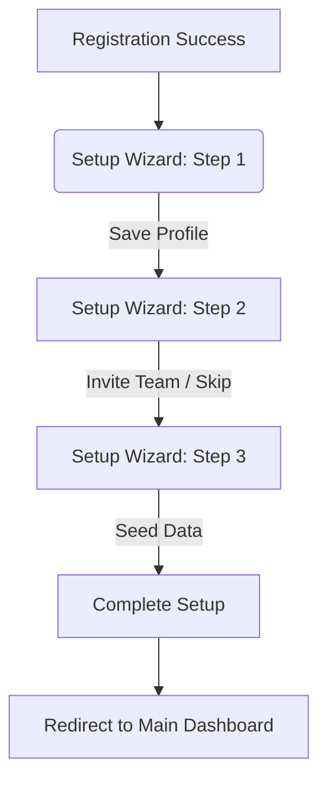

# Wireframe: First-Run Setup Wizard (AUTH)

## 1. Screen Purpose
Guide the Restaurant Owner through the initial setup of their StockPot workspace immediately after registration. It ensures mandatory base configuration is completed before they can access the main dashboard.

## 2. Mobile Layout
```text
+-------------------------------------------------+
|  Welcome to StockPot!                 [ 1 / 3 ] |
+-------------------------------------------------+
|  Step 1: Restaurant Profile                     |
|                                                 |
|  [     Restaurant Name *            ]           |
|  [     Currency (e.g., PHP) *       ]           |
|                                                 |
|  ( ) Enable Offline Sync (Recommended)          |
+-------------------------------------------------+
|                                                 |
| [               NEXT STEP                    ]  |
+-------------------------------------------------+
```

## 3. Desktop Layout
Centered, focused card (max-width `2xl` or `3xl`) on a solid background (`bg-background`). The progress indicator is a horizontal `mat-stepper` at the top of the card.
- **Step 1:** Profile (Name, Currency).
- **Step 2:** Team Invites (Add manager/staff emails).
- **Step 3:** Seed Catalog (Option to copy common Platform UoMs and standard ingredients into their local tenant).

## 4. Component Inventory
| Component | Material or Tailwind? | Notes |
| :--- | :--- | :--- |
| **Stepper Shell** | Material (`mat-stepper`) | Horizontal on desktop, mobile can be a simple progress bar. |
| **Input Fields** | Material (`mat-form-field`) | `appearance="outline"`. |
| **Switch/Toggle** | Material (`mat-slide-toggle`) | For enabling features like offline sync caching. |
| **CTA Button** | Material (`mat-flat-button`) | Primary color, advances stepper. |

## 5. Interaction & State Map
| Element | Default | Hover / Focus | Active | Loading | Error / Empty |
| :--- | :--- | :--- | :--- | :--- | :--- |
| **Input** | Outline | Primary border | Typing | N/A | Red outline / Hint |
| **Next Step** | Primary Green | Green hover | Ripple | Spinner | Disabled if invalid |

## 6. UX Flow Diagram


## 7. data-test-id Map
| Element Description | `data-test-id` |
| :--- | :--- |
| Restaurant Name Input | `auth-setup-name-input` |
| Navigation: Next Step | `auth-setup-next-btn` |
| Team Invite Input | `auth-setup-invite-input` |
| Finish Setup Button | `auth-setup-finish-btn` |
