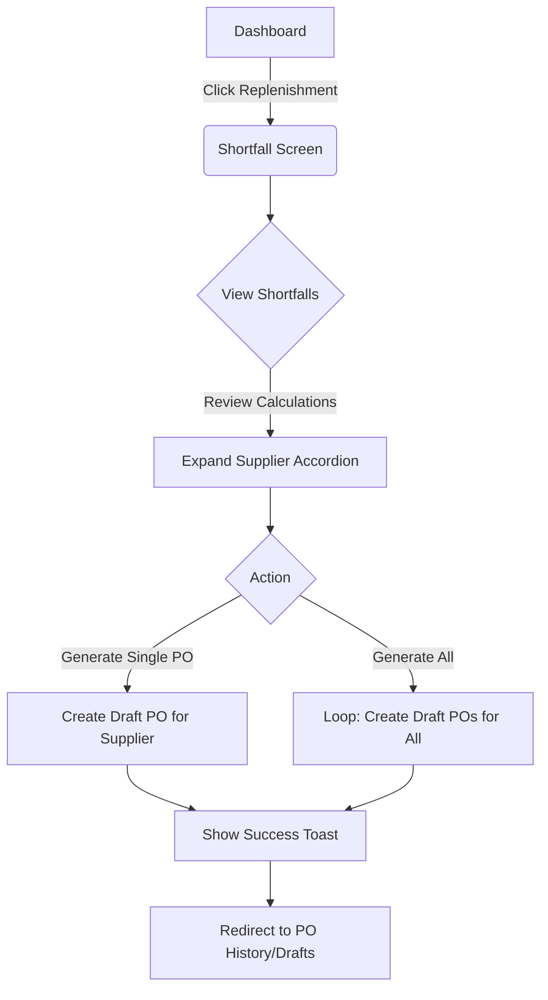

# Wireframe: Auto-PO Generation (REPO)

## 1. Screen Purpose
Empower the Restaurant Manager or Owner to view calculated shortfalls (based on current inventory vs. par levels) and rapidly generate draft Purchase Orders grouped by Supplier.

## 2. Mobile Layout
```text
+-------------------------------------------------+
| [Hamburger]  Replenishment Shortfalls           |
+-------------------------------------------------+
| [ Filter: All Suppliers v ]   [ Sort: Urgency ] |
+-------------------------------------------------+
| ! CRITICAL SHORTFALLS (2)                       |
+-------------------------------------------------+
| [v] FreshFarms Inc.                             |
|     - Tomatos    (Need: 15 Kg, Stock: 2 Kg)     |
|     - Onions     (Need: 10 Kg, Stock: 0 Kg)     |
|     [ Generate PO for FreshFarms ]              |
+-------------------------------------------------+
| [>] MeatCo Imports                              |
+-------------------------------------------------+
|                                                 |
| [      GENERATE ALL PENDING POs (2)          ]  |
+-------------------------------------------------+
```

## 3. Desktop Layout (Primary)
On desktop, the layout expands into a split-pane or a prominent data table structure. 
- **Top Row:** KPI summary cards (Total Missing Items, Est. PO Value, Critical Stockouts).
- **Main Area:** A detailed accordian or table grouping items by supplier. The user can view the math (Par Level - Current Stock = Shortfall) clearly formatted in columns.

## 4. Component Inventory
| Component | Material or Tailwind? | Notes |
| :--- | :--- | :--- |
| **KPI Cards** | Tailwind `div` | Bordered, light gray background, large green/red numbers. |
| **Supplier Accordion** | Material (`mat-expansion-panel`) | Groups shortfalls by vendor. |
| **Shortfall List** | Material (`mat-table` or Flex List) | Nested inside the accordion. |
| **Generate PO Button** | Material (`mat-stroked-button`) | Secondary color, placed inside each accordion. |
| **Generate All Button**| Material (`mat-flat-button`) | Primary color, sticky or prominent at top/bottom. |

## 5. Interaction & State Map
| Element | Default | Hover / Focus | Active | Loading | Error / Empty |
| :--- | :--- | :--- | :--- | :--- | :--- |
| **Accordion Row** | Collapsed | Gray background | Expanded | N/A | Empty state illust. if no shortfalls |
| **Generate PO** | Secondary Slate | Slate hover | Ripple | Outline Spinner | Toast error if vendor offline |
| **Generate All**| Primary Green | Green hover | Ripple | Spinner | Disabled if 0 shortfalls |

## 6. UX Flow Diagram


## 7. data-test-id Map
| Element Description | `data-test-id` |
| :--- | :--- |
| Main Generate All Button | `repo-generate-all-btn` |
| Supplier Accordion Toggle | `repo-supplier-panel-{vendorId}` |
| Shortfall Item Row | `repo-shortfall-item-{itemId}` |
| Individual Generate PO | `repo-generate-po-{vendorId}` |
| Empty State Container | `repo-shortfall-empty` |
