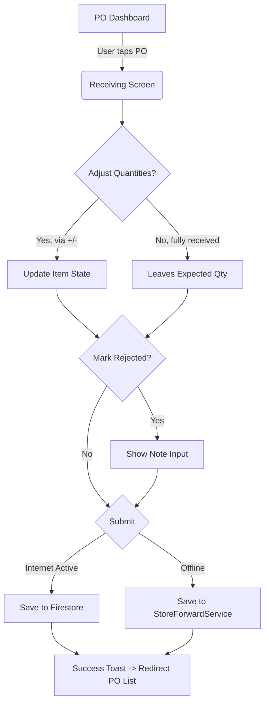

# Wireframe: Kitchen Receiving (KTCH)

## 1. Screen Purpose
Allow kitchen staff to quickly receive incoming goods against a specific Purchase Order, logging actual quantities using touch-friendly controls. It must function flawlessly in an offline state.

## 2. Mobile Layout (Primary)
```text
+-------------------------------------------------+
| [Hamburger]  Receiving: PO #1042      [Sync: 1] | <- Sync badge (Amber) if offline
+-------------------------------------------------+
| Supplier: FreshFarms Inc.                       |
| Status: IN TRANSIT          Expected: 14 items  |
+-------------------------------------------------+
|                                                 |
|  [ Card: Tomatos (Kg) ]                         |
|  Expected: 10 Kg                                |
|  +-------------------------------------------+  |
|  |  ( - )       [ 10.0 ]       ( + )         |  | <- 44px+ touch targets
|  +-------------------------------------------+  |
|  [ ] Mark as Damaged / Rejected                 |
|                                                 |
+-------------------------------------------------+
|                                                 |
|  [ Card: Onions (Kg) ]                          |
|  Expected: 5 Kg                                 |
|  +-------------------------------------------+  |
|  |  ( - )       [  5.0 ]       ( + )         |  |
|  +-------------------------------------------+  |
|                                                 |
+-------------------------------------------------+
|                                                 |
| [       CONFIRM RECEIVING (Save & Sync)      ]  | <- Sticky Footer Button 
+-------------------------------------------------+
```

## 3. Desktop Layout
On desktop or landscape tablets, the layout shifts to a multi-column card grid or a touch-optimized list where the adjusters `(-) [qty] (+)` are right-aligned on the same row as the item name, rather than stacked vertically.

## 4. Component Inventory
| Component | Material or Tailwind? | Notes |
| :--- | :--- | :--- |
| **App Header** | Material (`mat-toolbar`) | Sticky at top. |
| **Offline Badge** | Tailwind | Amber background (`bg-accent`), icon + count indicating queued items. |
| **Item Card** | Material (`mat-card`) | Needs internal padding (`p-4`) via Tailwind. |
| **Qty Adjuster** | Custom (Tailwind + Mat icons) | `mat-icon-button` nested in a flex row. Must be `h-[44px] w-[44px]`. |
| **Damaged Checkbox** | Material (`mat-checkbox`) | Expands a text area if checked. |
| **Submit Button** | Material (`mat-flat-button`) | Primary color, `w-full` on mobile, sticky bottom. |

## 5. Interaction & State Map
| Element | Default | Hover / Focus | Active | Loading | Error / Empty |
| :--- | :--- | :--- | :--- | :--- | :--- |
| **Qty (+) / (-)** | Slate background | Slightly darker slate | Ripple effect | Disabled | N/A |
| **Reject Check** | Unchecked | Ripple effect | Checked | Disabled | N/A |
| **Submit Button**| Primary Green | Green hover | Ripple | Shows spinner inside | Red text if validation fails |
| **Offline Badge**| Hidden (if online) | N/A | N/A | Pulse animation | N/A |

## 6. UX Flow Diagram


## 7. data-test-id Map
| Element Description | `data-test-id` |
| :--- | :--- |
| Screen Title / Header | `ktch-receiving-header` |
| Offline Sync Indicator | `sync-offline-badge` |
| Item Card Container | `ktch-receive-card-{itemId}` |
| Decrease Qty Button | `ktch-receive-dec-{itemId}` |
| Increase Qty Button | `ktch-receive-inc-{itemId}` |
| Quantity Display | `ktch-receive-qty-{itemId}` |
| Reject Checkbox | `ktch-receive-reject-{itemId}` |
| Submit Receiving Button| `ktch-receive-submit-btn` |
