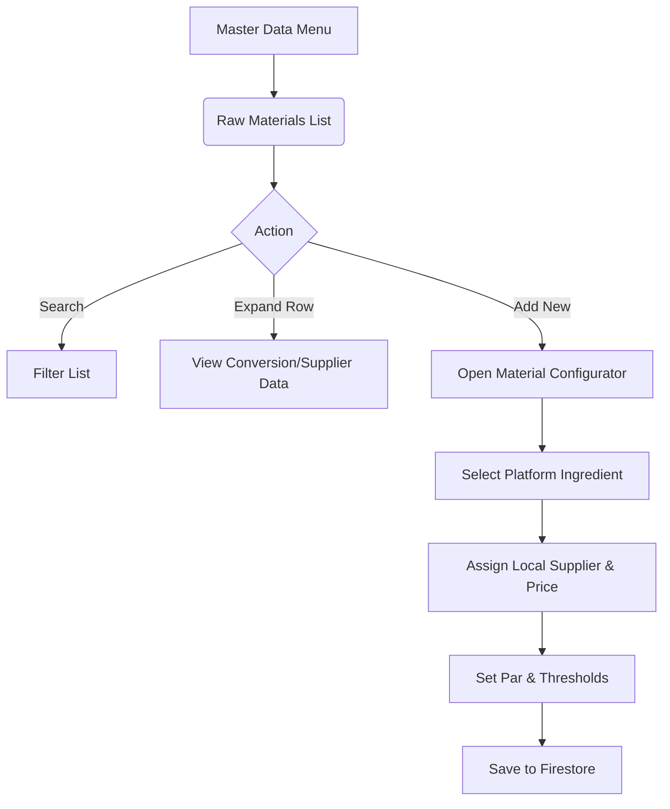

# Wireframe: Master Raw Materials (MSTR)

## 1. Screen Purpose
Restaurant-level configuration for inventory items. Owners connect Platform Ingredients to their local suppliers, defining par levels, critical thresholds, and local purchasing units (e.g., buying in "Sacks" but tracking in "Kg").

## 2. Mobile Layout
```text
+-------------------------------------------------+
| [Hamburger]  Raw Materials        [ + Add New ] |
+-------------------------------------------------+
| [ Search items... ]                             |
+-------------------------------------------------+
|  Tomatoes, Roma                                 |
|  Par: 15 Kg | Stock: 10 Kg | Cr. Thr: 5 Kg      |
|  [ Supplier: FreshFarms Inc. v ]                |
+-------------------------------------------------+
|  Flour, All-Purpose                             |
|  Par: 50 Kg | Stock: 20 Kg | Cr. Thr: 10 Kg     |
|  [ Supplier: BulkCo          v ]                |
+-------------------------------------------------+
```

## 3. Desktop Layout
- **Header:** Title + Bulk Import button + Add New item button.
- **Data Table:** Extensive table featuring the Platform Ingredient Name, Local Nickname, Main Supplier, Par Minimum, Critical Threshold, current Stock levels, and Yield %.
- **Row Expansion:** Clicking a row expands it (`multiTemplateDataRows`) to reveal purchasing conversions (e.g. 1 Sack = 25 Kg at $40.00).

## 4. Component Inventory
| Component | Material or Tailwind? | Notes |
| :--- | :--- | :--- |
| **Search Input**| Material (`mat-form-field`) | Live filtering. |
| **Nested Table**| Material (`mat-table`) | Uses expandable rows. |
| **Add Form** | Material (`mat-dialog` or routing) | Complex object requiring its own side-panel or full screen route on mobile. |

## 5. Interaction & State Map
| Element | Default | Hover / Focus | Active | Loading | Error / Empty |
| :--- | :--- | :--- | :--- | :--- | :--- |
| **Row** | White | Slate-50 | Expanded | N/A | N/A |
| **Stock Alert**| Slate text | N/A | N/A | N/A | Red text if below critical threshold |

## 6. UX Flow Diagram


## 7. data-test-id Map
| Element Description | `data-test-id` |
| :--- | :--- |
| Search Bar | `mstr-material-search` |
| Add Material Button | `mstr-material-add-btn` |
| Material Row | `mstr-material-row-{id}` |
| Material Config Save | `mstr-material-save-btn` |
| Platform Ingredient Select | `mstr-platform-ing-select` |
