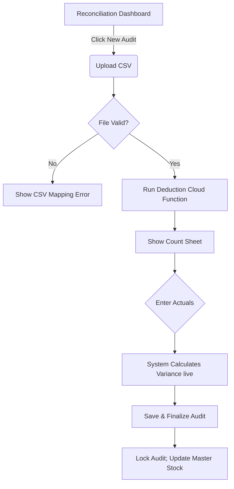

# Wireframe: Variance Audit & Reconciliation (RCNC)

## 1. Screen Purpose
A desktop-first interface primarily designed for the Owner/Manager to upload end-of-day POS reports (CSV). It runs theoretical sub-component deductions based on recipes and displays a "Expected vs. Actual" stock count sheet to highlight and pinpoint variance (theft, spoilage, or over-portioning).

## 2. Mobile Layout
```text
+-------------------------------------------------+
| [Hamburger]  End of Day Reconciliation          |
+-------------------------------------------------+
|  [ Upload POS Sales CSV ] -> Tap to select      |
+-------------------------------------------------+
|                                                 |
|  [ Processing Deductions...                     |
|  Found 140 sales matching 24 recipes. ]         |
|                                                 |
+-------------------------------------------------+
|                                                 |
|  [ Start Physical Count (24 Items) ]           |
+-------------------------------------------------+
```
*Note: The actual grid-heavy comparison is pushed to desktop.*

## 3. Desktop Layout (Primary)
This interface relies heavily on a structured workflow (Stepper) or a split-pane layout to walk the owner through the audit without overwhelming them with data immediately.
- **Top:** A clear Material Stepper (1. Upload POS -> 2. Review Deductions -> 3. Enter Actuals -> 4. Finalize Audit).
- **Body (Step 3: Count Sheet):** A comprehensive, wide Material Table (`mat-table`).
  - Columns: Ingredient Name, Starting Stock, POS Deductions, **Expected Stock**, [ Actual Input Box ], **Variance**.
  - The Variance column changes color based on thresholds: Red for massive negative variance (missing stock), Amber for minor acceptable discrepancies, Green for exact matches.

## 4. Component Inventory
| Component | Material or Tailwind? | Notes |
| :--- | :--- | :--- |
| **Workflow Step** | Material (`mat-step`) | Linear workflow. |
| **File Dropzone** | Tailwind + Plugin | Dashed border, light background. Drag-and-drop support. |
| **Audit Table** | Material (`mat-table`) | Dense style, sortable columns. |
| **Actual Input**| Material (`mat-form-field`) | `type="number"`, dense, outline. |
| **Variance Badge**| Tailwind `span` | Color-coded based on positive/negative value. |
| **Save Audit Btn**| Material (`mat-flat-button`) | Primary color at the end of the stepper. |

## 5. Interaction & State Map
| Element | Default | Hover / Focus | Active | Loading | Error / Empty |
| :--- | :--- | :--- | :--- | :--- | :--- |
| **Dropzone** | Dashed slate | Blue dash on dragover | File dropped | Progress bar | Red border if invalid CSV |
| **Table Input**| White background | Blue outline (`primary`) | Typing | N/A | Red outline if text entered |
| **Variance** | Slate (No input) | N/A | N/A | N/A | Red text (`text-error`) |

## 6. UX Flow Diagram


## 7. data-test-id Map
| Element Description | `data-test-id` |
| :--- | :--- |
| CSV Upload Dropzone | `rcnc-upload-csv` |
| Upload Error Message | `rcnc-upload-error` |
| Stepper Progression | `rcnc-stepper-next` |
| Actual Qty Input Box | `rcnc-actual-input-{itemId}` |
| Variance Cell Display | `rcnc-variance-label-{itemId}` |
| Finalize Audit Button | `rcnc-finalize-btn` |
