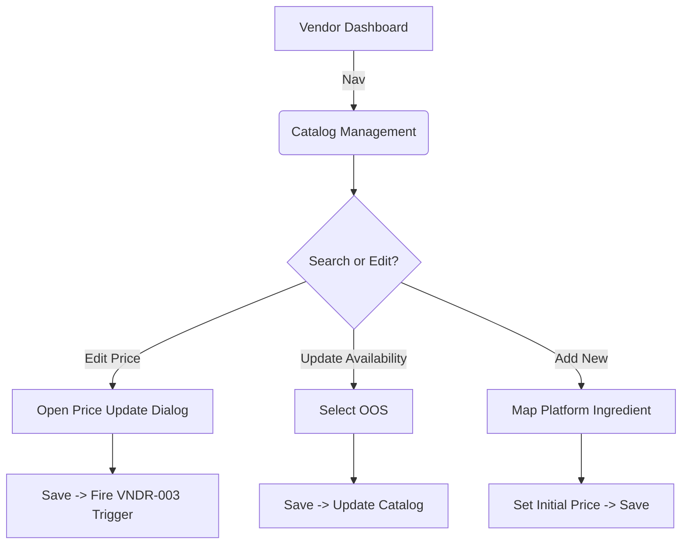

# Wireframe: Vendor Catalog Management (VNDR)

## 1. Screen Purpose
A streamlined portal within the `vendor-app` allowing a supplier representative to self-manage the prices and availability of the ingredients they supply to restaurants within the StockPot platform. 

## 2. Mobile Layout
```text
+-------------------------------------------------+
| [Hamburger]  Supplier Portal: Catalog           |
+-------------------------------------------------+
|  [Search Ingredients...]      [+] Add Item      |
+-------------------------------------------------+
|                                                 |
|  [ Card: Sliced White Onions (Kg) ]             |
|  ID: V-10923                                    |
|                                                 |
|  [ Current Price: $4.50 / Kg ]    [ Edit ]      |
|  Status: [ Available v ]                        |
+-------------------------------------------------+
|                                                 |
|  [ Card: Bulk Tomatoes (Crts.) ]                |
|  ID: V-8899                                     |
|                                                 |
|  [ Current Price: $12.00 / Crt ]  [ Edit ]      |
|  Status: [ Out of Stock v ]                     |
+-------------------------------------------------+
```

## 3. Desktop Layout
The primary layout for managing large text datasets. Utilizes a responsive data table.
- **Top Bar:** Quick search to filter their massive catalogs. "Add Item" button spanning out to a selection modal.
- **Table Columns:** Platform Ingredient Name, Vendor SKU (Optional), UoM, Current Price, Status (Dropdown), Actions (Edit Price dialog trigger).

## 4. Component Inventory
| Component | Material or Tailwind? | Notes |
| :--- | :--- | :--- |
| **Search Bar** | Material (`mat-form-field`) | `appearance="outline"` with magnifying glass suffix. |
| **Add Item Dialog**| Material (`mat-dialog`) | Opens a modal to map a Platform Ingredient to their catalog. |
| **Catalog List** | Material (`mat-table` / Flex Cards) | Adjusts based on breakpoint. |
| **Status Select**| Material (`mat-select`) | Fast toggle between 'Available' / 'Out of Stock'. |
| **Edit Price Btn**| Tailwind `button` | Ghost button linking to inline edit or distinct form field. |

## 5. Interaction & State Map
| Element | Default | Hover / Focus | Active | Loading | Error / Empty |
| :--- | :--- | :--- | :--- | :--- | :--- |
| **Status Dropdown**| Green 'Available' | Slate background | Selected | Show spinner adjacent | N/A |
| **Edit Price**| Secondary Slate | Primary Green | Ripple | Disabled | Validation failure (NaN) |
| **Add Item** | Primary Green | Dark Green hover | Ripple | Spinner | Empty: "Platform mapping lost" |

## 6. UX Flow Diagram


## 7. data-test-id Map
| Element Description | `data-test-id` |
| :--- | :--- |
| Main Search Bar | `vndr-catalog-search` |
| Add Item Button | `vndr-add-item-btn` |
| Status Dropdown Select | `vndr-status-select-{itemId}` |
| Edit Price Trigger | `vndr-edit-price-{itemId}` |
| Price Input Dialog Field | `vndr-price-input` |
| Save Price Update | `vndr-save-price-btn` |
